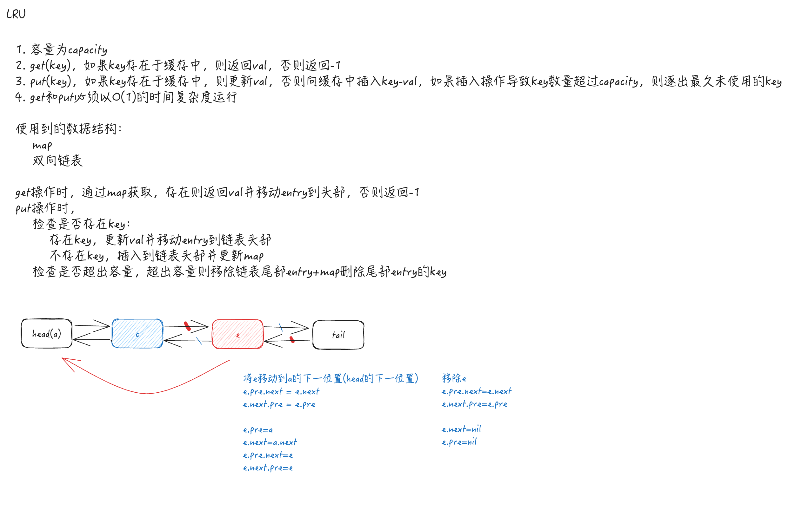

# [146.LRU缓存](https://leetcode.cn/problems/lru-cache/)

请你设计并实现一个满足  LRU (最近最少使用) 缓存 约束的数据结构。
- 实现 LRUCache 类：
- LRUCache(int capacity) 以 正整数 作为容量 capacity 初始化 LRU 缓存
- int get(int key) 如果关键字 key 存在于缓存中，则返回关键字的值，否则返回 -1 
- void put(int key, int value) 如果关键字 key 已经存在，则变更其数据值 value ；如果不存在，则向缓存中插入该组 key-value 。如果插入操作导致关键字数量超过 capacity ，则应该 逐出 最久未使用的关键字。
- 函数 get 和 put 必须以 O(1) 的平均时间复杂度运行

```
type LRUCache struct {

}


func Constructor(capacity int) LRUCache {

}


func (this *LRUCache) Get(key int) int {

}


func (this *LRUCache) Put(key int, value int)  {

}


/**
 * Your LRUCache object will be instantiated and called as such:
 * obj := Constructor(capacity);
 * param_1 := obj.Get(key);
 * obj.Put(key,value);
 */
```

# 
